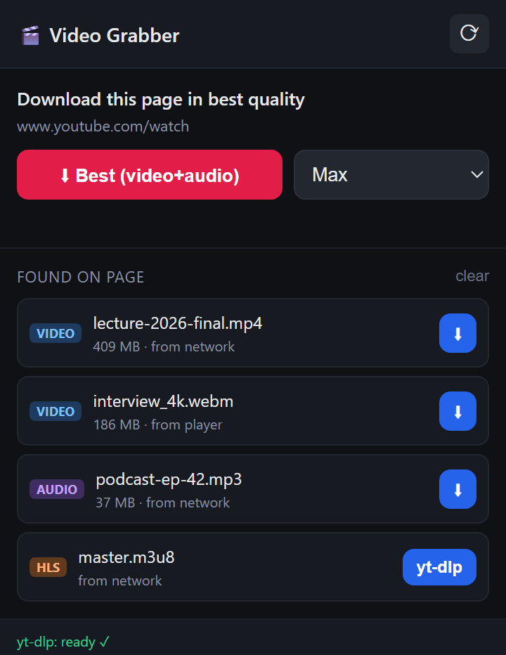

# 🎬 Video Grabber

**See a video worth keeping? Click once. It's on your disk.**

A Chrome extension that finds the video on whatever page you're on and downloads it. No pasting links into sketchy websites, no "premium to unlock 1080p", no waiting rooms.

[Русская версия](README.ru.md)



---

## Why this one

Most "video downloaders" fall into two camps: browser extensions that only handle plain MP4 files and give up on YouTube, or websites where you paste a link, dodge three popups, and get a watermarked 480p file. This one does both halves properly:

- **One click, no link juggling.** Open the popup, hit the button. That's the whole workflow. The thing you wanted to save is saved before you've forgotten why you wanted it.
- **Actually gets max quality on YouTube.** Modern YouTube ships video and audio as separate encrypted streams. Extensions that pretend otherwise hand you a silent file or a 360p one. Video Grabber delegates to [yt-dlp](https://github.com/yt-dlp/yt-dlp) + ffmpeg, which fetch both streams and mux them: 4K with sound if that's what's on offer.
- **Works on logged-in videos.** Age-restricted, private, unlisted, subscriber-only. The extension hands your existing session cookies to yt-dlp through the browser's own API, so you don't have to close Chrome or export anything. (More on this below. It's the part every other tool gets wrong.)
- **Sees what the page is actually loading.** It watches network traffic and the DOM, so it catches videos that never appear as a visible download link, including HLS streams.
- **Everything stays local.** No accounts, no servers, no telemetry. The extension talks to a Python script on your own machine and nothing else.
- **Not just YouTube.** The yt-dlp backend covers ~1800 sites. The direct-file grabber covers most of the rest.

**Bonus:** pick "Audio only" and you get an MP3. Handy for talks, interviews, and podcasts you'd rather listen to than watch.

---

## Requirements

| Tool | Why | Install |
|------|-----|---------|
| **Python 3.8+** | runs the native host | [python.org](https://python.org) |
| **yt-dlp** | downloads from YouTube & co. | `pip install -U yt-dlp` |
| **ffmpeg** | muxes video + audio | `winget install Gyan.FFmpeg` (Win) · `brew install ffmpeg` (Mac) · `apt install ffmpeg` (Linux) |
| **Node.js or Deno** | **required since 2026**: YouTube needs a JS runtime to decipher stream URLs | `winget install OpenJS.NodeJS` |

The installer checks all four and tells you what's missing.

> Only downloading plain MP4/WebM files? You can skip every one of these and just do Step 1.

---

## Install

### Step 1. Load the extension

1. Download or clone this repo.
2. Open `chrome://extensions`
3. Turn on **Developer mode** (top right)
4. Click **Load unpacked** → select the repo folder
5. The 🎬 icon appears. Pin it for one-click access.

Direct file downloads work right now. For YouTube, continue.

### Step 2. Install the yt-dlp bridge

From the repo folder:

```bash
python install_native_host.py
```

That's it, no arguments. The script finds your extension ID by itself, writes the [native messaging](https://developer.chrome.com/docs/apps/nativeMessaging/) manifest, and registers it for Chrome, Edge, Brave and Chromium. No admin rights needed.

### Step 3. Restart your browser

Fully quit and reopen it. Open the popup: the footer should read **`yt-dlp: ready ✓`** in green.

> Still red? Jump to [Troubleshooting](#troubleshooting).

---

## How to use it

Click the 🎬 icon:

**Top section: "Download this page in best quality"**
The YouTube path, and the one you'll use most. Press the red button and yt-dlp downloads the page's video, muxes audio in, and drops it in your Downloads folder. The dropdown picks quality: `Max`, `≤1080p`, `≤720p`, `≤480p`, or `Audio only (mp3)`.

**Bottom section: "Found on page"**
Direct media files spotted on the page. `⬇` saves instantly. Items tagged `HLS`/`DASH` are streams, so their button routes through yt-dlp instead.

The badge number on the icon = media found on this tab. Empty list? Hit ▶ Play on the video, then ⟳ in the popup. Some players don't request the video until you start it.

---

## Cookies: what to click, and why it matters

**Short version: there is nothing to click. It's automatic.** But it's worth knowing why, because this is where other downloaders fail.

Age-restricted, private, unlisted and subscriber-only videos need your login to download. yt-dlp's usual answer is `--cookies-from-browser chrome`, which reads Chrome's cookie database directly. That fails the moment Chrome is running:

```
ERROR: Could not copy Chrome cookie database
```

The file is locked by the running browser. So the "official" workaround is to close Chrome entirely, which is absurd given you found the video *in* Chrome.

Video Grabber sidesteps this. The extension already has legitimate access to your cookies through the browser's `chrome.cookies` API, so it reads them directly, hands them to the local host, which writes a temporary Netscape-format cookie file, passes it to yt-dlp, and **deletes it as soon as the download finishes**. Chrome stays open. Nothing is exported to disk permanently, and nothing leaves your machine.

Practical upshot: **stay logged in to the site in the same Chrome profile**, and restricted videos just work. If a video downloads fine in a private window on the site, it'll download fine here.

> The `cookies` permission exists solely for this. Cookies go to one place: the local yt-dlp process on your own computer.

---

## What it can't do

Being straight with you:

- **DRM-protected content** (Netflix, Disney+, paid platforms) is encrypted by design. Not supported, and not something this project will try to work around.
- **Blob-only videos with no source URL.** Some players stream via MediaSource with no fetchable URL. The yt-dlp button still handles these if the site is supported.
- **YouTube breaks downloaders regularly.** When something stops working, update first: `pip install -U yt-dlp`. Once every couple of months is about right.

---

## Troubleshooting

**Footer says `Specified native messaging host not found`**
The bridge isn't installed, or the extension ID changed (moving the folder changes it, since the ID is derived from the path). Re-run `python install_native_host.py` and restart the browser.

**`Video unavailable`, but the video plays fine in the browser**
Almost always a stale yt-dlp or a missing JS runtime:
```bash
pip install -U yt-dlp
node --version   # must print something
```
If both check out, the video likely needs a login. Make sure you're signed in on that site in this Chrome profile.

**Only low quality available, 1080p+ formats missing**
The JS challenge solver didn't run. Confirm `node` or `deno` is on your PATH, and that you have internet access: the solver is fetched from GitHub on first use.

**Downloaded file has no sound**
ffmpeg is missing, so the audio stream never got muxed in. Install it and re-download.

---

## How it works

```
┌──────────────┐   video URLs   ┌────────────────┐
│  content.js  │ ─────────────► │  background.js │  watches webRequest + DOM
└──────────────┘                └───────┬────────┘
                                        │ media list, cookies
                                        ▼
                                ┌────────────────┐
                                │    popup.js    │  the UI
                                └───────┬────────┘
                                        │ native messaging (stdio + JSON)
                                        ▼
                             ┌─────────────────────┐
                             │ native/yt_dlp_host  │  spawns yt-dlp,
                             │        .py          │  streams progress back
                             └─────────────────────┘
```

| File | Role |
|------|------|
| `manifest.json` | MV3 extension manifest |
| `background.js` | sniffs media URLs from network traffic; builds the cookie file |
| `content.js` | scrapes `<video>`/`<source>` elements, watches for SPA changes |
| `popup.html` / `.css` / `.js` | the interface |
| `native/yt_dlp_host.py` | native host: receives a URL, runs yt-dlp, reports progress |
| `install_native_host.py` | installer: auto-detects extension ID, registers the host |
| `_locales/` | UI translations (English, Russian) |
| `tools/make_screenshot.py` | renders the README screenshot from the real popup code |

The UI follows your browser language: Russian if that's your locale, English otherwise. PRs adding locales are welcome: copy `_locales/en/messages.json` and translate the values.

---

## License

MIT, see [LICENSE](LICENSE).

Downloading is your responsibility: respect copyright and each site's terms of service. This tool is meant for saving things you're allowed to save.
